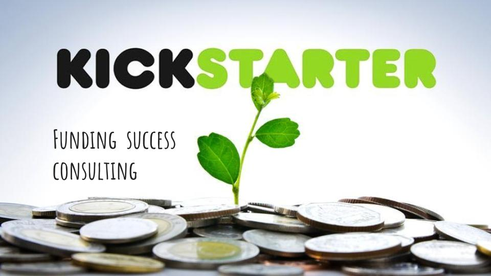

# Kickstarter Success?


<br>
<br>
<br>


If you want to do a Kickstarter project, how would you now if there is a good chance that you succeed? Within this project we use machine learning to show you what is important to make your kickstarter project successful. This project was part of the Neue Fische Data Science Bootcamp as second project and was developed within 3 days together with [Arash Momeni](.....) and [Thomas Roider](....).
For a short overview you can have a look on our [slides](...), we presented as our final presentation to the Neue Fische Team and our Course.

<br>

## __The Dataset__
<br>

The dataset for this project was downloaded in .csv format from a webscraping site called [Web Robots](https://webrobots.io/kickstarter-datasets/). The dataset contains data of all projects hosted on Kickstarter April 2009 and March 2019.
<br>
<br>
<br>

---

## Requirements and Environment

If you you want to retry or work further, here are the instructions to use our code.

Requirements:
- pyenv with Python: 3.9.8

Environment: 

For installing the virtual environment you can either use the Makefile and run `make setup` or install it manually with the following commands: 

```Bash
pyenv local 3.9.8
python -m venv .venv
source .venv/bin/activate
pip install --upgrade pip
pip install -r requirements.txt
```

## __Usage__

## Training

!!! Make sure you have downloaded the right dataset, saved it in the existing data folder and 
changed the your data path under Importing Data!!!

In order to train the model and store test data in the automatically created folders /data_preprocessed and /model run:

```bash
#activate env
source .venv/bin/activate


Then run:

python Kickstarter_succes_files/train.py  
```

## Prediction

!!! Make sure that your test set has the same structure and the same number of columns as 
the example in the /data/Kickstarter_test folder !!!

In order to test that predict works on your test set you created run:

```bash
python Kickstarter_succes_files/predict.py models/linear_regression_model.sav data/X_test.csv data/y_test.csv
```

## Limitations

Development libraries are part of the production environment, normally these would be separate as the production code should be as slim as possible.
